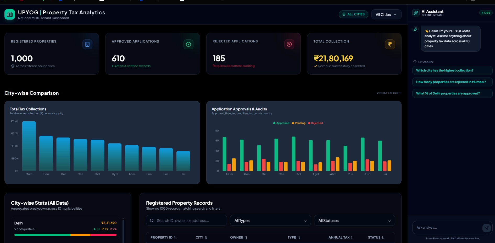

# 🏙️ UPYOG Property Tax Analytics Dashboard

> A smart city property tax analytics platform built for the UPYOG multi-tenant system.
> Covers 10 Indian cities with live KPI tracking, city-wise comparisons, and an AI-powered chat analyst.

🔗 **Live Demo** → [https://property-analytics-dashboard.vercel.app/](https://property-analytics-dashboard.vercel.app/)



---

## ⚙️ Tech Stack

| Technology | Purpose |
|---|---|
| React | UI Framework |
| Tailwind CSS | Utility-first Styling |
| Recharts | Chart Visualizations |
| Google Gemini 2.0 Flash | AI Chat Assistant (free tier) |
| Lucide React | Icon Library |
| Vercel | Deployment |

---

## 🚀 Setup & Installation

### 1. Clone the repository

```bash
git clone https://github.com/abhiJunior/Property-Analytics-Dashboard.git
```

### 2. Navigate into the project folder

```bash
cd Property-Analytics-Dashboard
```

### 3. Install dependencies

```bash
npm install
```

### 4. Configure environment variables

```bash
cp .env.example .env
```

Open `.env` and add your Gemini API key:

```env
REACT_APP_GEMINI_API_KEY=your_gemini_api_key_here
```

> 🔑 Get a **free API key** at: [https://aistudio.google.com/app/apikey](https://aistudio.google.com/app/apikey)

### 5. Add the data file

Place `properties.json` inside the `src/` folder.
The app imports it directly — **no backend or database needed**.

### 6. Start the development server

```bash
npm run dev
```

Open [http://localhost:3000](http://localhost:3000) in your browser.

---

## ✨ Features

- **KPI Dashboard** — Total registered, approved, rejected properties and total collection per city
- **Tenant Filter** — Custom styled dropdown to filter all KPIs live by city
- **City Comparison Charts** — Bar chart (collection) + grouped bar chart (status breakdown)
- **AI Chat Assistant** — Ask questions in plain English, powered by Gemini 2.0 Flash
- **Staggered Animations** — Cards fade and slide in on page load
- **Skeleton Loading** — Shimmer placeholders while data initializes
- **Fully Responsive** — Works seamlessly on mobile, tablet, and desktop

---

## 🏙️ Cities Covered

Delhi • Mumbai • Pune • Bengaluru • Chennai • Hyderabad • Ahmedabad • Kolkata • Jaipur • Lucknow

---

## 🔒 Security

- `.env` is listed in `.gitignore` — your API key is **never committed** to GitHub
- Never share or expose your `REACT_APP_GEMINI_API_KEY` publicly
- See `.env.example` for the required environment variable format

---

## 📁 Project Structure

```
src/
├── components/
│   ├── AIChatAssistant.jsx
│   ├── CityComparisonChart.jsx
│   └── Dashboard.jsx
├── hooks/
│   └── usePropertyData.js
├── properties.json
└── App.jsx
```

---

## 👤 Author

**Abhishek** — [github.com/abhiJunior](https://github.com/abhiJunior)

---

*UPYOG Smart City Platform | Property Tax Module | Data: 1,000 records across 10 cities*